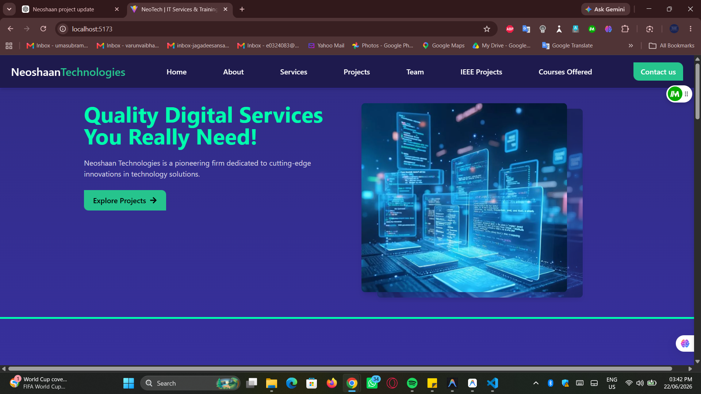
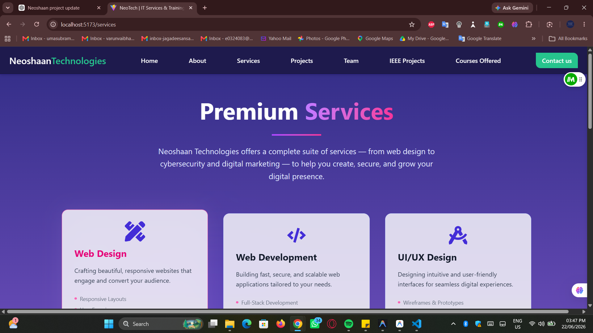
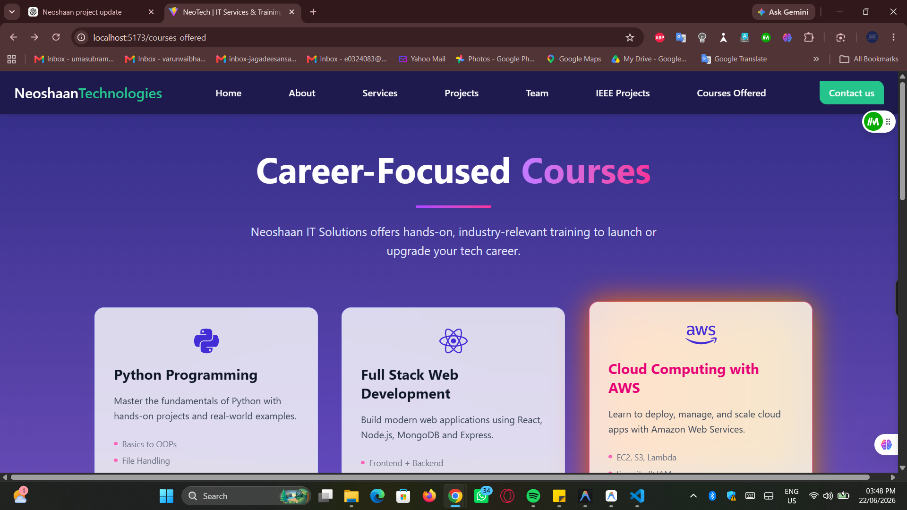
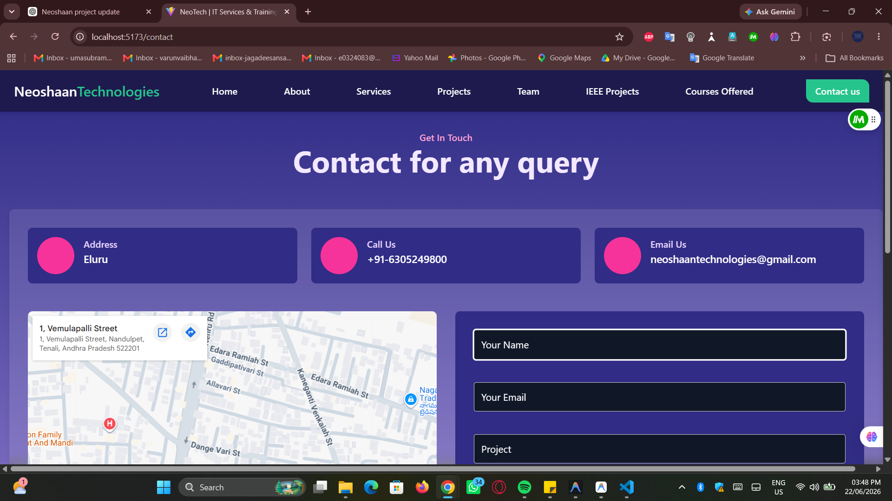

# Neoshaan Technologies Website

A modern and responsive company website developed for **Neoshaan Technologies**, showcasing IT services, professional training programs, career opportunities, and customer engagement features.

## 🚀 Features

- Modern responsive UI
- Home, About, Services, Courses, Careers, and Contact pages
- Detailed course catalog
- Course details page with dynamic routing
- Contact form with email integration
- Job application form
- Mobile-friendly design
- Fast performance using React and Vite

## 🛠️ Tech Stack

### Frontend
- React.js
- Vite
- HTML5
- CSS3
- JavaScript (ES6+)
- React Router DOM

### Backend
- Node.js
- Express.js
- Nodemailer

### Tools
- Git
- GitHub
- VS Code

## 📂 Project Structure

```bash
Neoshaan_Technologies/
│
├── src/
│   ├── components/
│   ├── pages/
│   ├── assets/
│   └── App.jsx
│
├── backend/
│   ├── routes/
│   ├── server.js
│   └── config/
│
├── public/
├── package.json
└── README.md
```

## 📚 Courses Offered

- Python Programming
- Web Development
- Data Science
- Cloud Computing
- Networking
- Android Development
- UI/UX Design
- Corporate Training

## 📧 Contact Features

Users can:

- Send inquiries through the contact form
- Apply for courses
- Submit career applications
- Receive email acknowledgements

## ⚙️ Installation

### Clone Repository

```bash
git clone https://github.com/theflighttechofficial/Neoshaan_Technologies.git
```

### Navigate to Project

```bash
cd Neoshaan_Technologies
```

### Install Dependencies

```bash
npm install
```

### Run Development Server

```bash
npm run dev
```

### Backend Setup

```bash
cd backend
npm install
node server.js
```

## 📸 Screenshots

### Home Page


### Services Page


### Courses Page


### Contact Page


## 🎯 Purpose

This project was developed to provide Neoshaan Technologies with a professional online presence, enabling customers and students to explore services, training programs, and career opportunities efficiently.

## 👨‍💻 Developed By

**Varun Vaibhav**

Computer Science Engineering (AI & Data Analytics)

Sri Ramachandra Institute of Higher Education and Research

## 📄 License

This project is developed for educational and business purposes.

---

⭐ If you like this project, consider giving it a star on GitHub.
